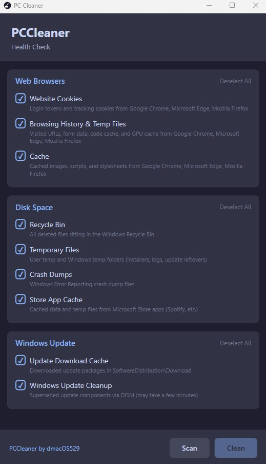

# PC Cleaner

[-blue?style=for-the-badge&logo=windows)](https://github.com/dmacOS529/PCCleaner/releases/latest/download/PCCleaner-SelfContained.exe)
[-green?style=for-the-badge&logo=windows)](https://github.com/dmacOS529/PCCleaner/releases/latest/download/PCCleaner-Lightweight.zip)

A lightweight Windows desktop application for cleaning browser data and freeing disk space. Built as a simple, no-bloat alternative to other tools - focused on doing a few things well.

## Screenshot



## Overview

PC Cleaner performs a **Health Check** scan across three areas:

1. **Web Browsers** — Cleans cookies, browsing history, temporary files, and cache from Chrome, Edge, and Firefox
2. **Disk Space** — Empties the Recycle Bin, clears temporary files, crash dumps, and Microsoft Store app caches
3. **Windows Update** — Clears the update download cache and runs DISM component cleanup

The app uses a two-phase workflow: **Scan** first to preview what will be cleaned (file count and size), then **Clean** to delete the selected items. Files that are locked or permission-denied are safely skipped. The app requests **administrator elevation** on launch (required for Windows Update cleanup and system temp files).

## Tech Stack

- **Language:** C# (.NET 8)
- **UI Framework:** WPF (Windows Presentation Foundation)
- **Architecture:** MVVM (Model-View-ViewModel)
- **NuGet Packages:** [CommunityToolkit.Mvvm](https://www.nuget.org/packages/CommunityToolkit.Mvvm) 8.4.0 — provides `ObservableObject`, `RelayCommand`, and source generators for clean MVVM binding
- **Target:** `net8.0-windows`, published as a self-contained single-file `.exe`

## What Each Option Does

### Web Browsers

The app auto-detects which browsers are installed and only shows those that are present. All browser profiles are enumerated dynamically (Chrome/Edge: `Default` + `Profile 1`, `Profile 2`, etc. | Firefox: all subdirectories under `Profiles\`).

#### Website Cookies

Deletes cookie databases and their SQLite companion files.

| Browser | Files Deleted |
|---------|--------------|
| Chrome | `%LOCALAPPDATA%\Google\Chrome\User Data\{profile}\Network\Cookies` (`-journal`, `-wal`, `-shm`) |
| Edge | `%LOCALAPPDATA%\Microsoft\Edge\User Data\{profile}\Network\Cookies` (`-journal`, `-wal`, `-shm`) |
| Firefox | `%APPDATA%\Mozilla\Firefox\Profiles\{profile}\cookies.sqlite` (`-wal`, `-shm`) |

**Impact:** Logs you out of all websites. Removes tracking cookies and session tokens.

#### Browsing History & Temp Files

Deletes history databases, form data, and browser-generated temporary files.

| Browser | Files Deleted |
|---------|--------------|
| Chrome | `{profile}\History` (`-journal`, `-wal`, `-shm`), `{profile}\Code Cache\*`, `{profile}\GPUCache\*` |
| Edge | `{profile}\History` (`-journal`, `-wal`, `-shm`), `{profile}\Code Cache\*`, `{profile}\GPUCache\*` |
| Firefox | `{profile}\places.sqlite` (`-wal`, `-shm`), `{profile}\formhistory.sqlite`, `{profile}\startupCache\*` |

**Impact:** Clears visited URL history, search history, form autofill entries, compiled JavaScript cache, and GPU shader cache.

#### Cache

Deletes cached web resources (images, scripts, stylesheets, HTML pages).

| Browser | Directories Cleared |
|---------|-------------------|
| Chrome | `%LOCALAPPDATA%\Google\Chrome\User Data\{profile}\Cache\Cache_Data\*` |
| Edge | `%LOCALAPPDATA%\Microsoft\Edge\User Data\{profile}\Cache\Cache_Data\*` |
| Firefox | `%LOCALAPPDATA%\Mozilla\Firefox\Profiles\{profile}\cache2\entries\*` |

**Impact:** Browsers will re-download resources on next visit. Pages may load slightly slower on first visit after cleaning.

### Disk Space

#### Recycle Bin

Empties the Windows Recycle Bin across all drives using the native Shell32 API.

- **API:** `SHEmptyRecycleBin` (silent, no confirmation dialog, no sound)
- **Scan API:** `SHQueryRecycleBin` to get item count and total size before cleaning
- **Scope:** All drives

**Impact:** Permanently deletes all files in the Recycle Bin. These cannot be recovered after cleaning.

#### Temporary Files

Scans and deletes files from Windows temporary directories.

| Path | Description |
|------|------------|
| `%LOCALAPPDATA%\Temp\*` (aka `%TEMP%`) | User temp folder — installer leftovers, app logs, update residue |
| `%WINDIR%\Temp\*` | System temp folder — requires admin for some files |

**Impact:** Removes temporary files from all applications. Running apps may have locks on some files — these are skipped. No admin elevation required, but some system temp files may be inaccessible.

#### Crash Dumps

Deletes Windows Error Reporting crash dump files.

| Path | Description |
|------|------------|
| `%LOCALAPPDATA%\CrashDumps\*` | Crash dump files generated when applications crash |

**Impact:** Removes diagnostic crash data. Only useful if you're not actively debugging application crashes.

#### Store App Cache

Clears cached data and temporary state from all Microsoft Store applications (Spotify, etc.).

| Path | Description |
|------|------------|
| `%LOCALAPPDATA%\Packages\*\LocalCache\*` | Cached data for each Store app |
| `%LOCALAPPDATA%\Packages\*\TempState\*` | Temporary state files for each Store app |

**Impact:** Store apps regenerate this data on next launch. Can free significant space — e.g., Spotify can cache several GB of streamed music data.

### Windows Update

#### Update Download Cache

Deletes downloaded update packages from the Windows Update cache.

| Path | Description |
|------|------------|
| `%WINDIR%\SoftwareDistribution\Download\*` | Cached update installers and patches |

**Impact:** Windows will re-download updates if needed. Safe to clean — these are already-installed update packages. Requires admin elevation.

#### Windows Update Cleanup

Runs DISM component store cleanup to remove superseded update components.

- **Scan:** `DISM /Online /Cleanup-Image /AnalyzeComponentStore` — checks if cleanup is recommended
- **Clean:** `DISM /Online /Cleanup-Image /StartComponentCleanup` — removes superseded components (may take a few minutes)

**Impact:** Removes old versions of updated Windows components. Cannot be undone but is safe — only removes components that have been fully superseded. Requires admin elevation.

## Error Handling

- **Locked files:** If a browser or app is running, some files will be locked. The app catches `IOException` and skips these files, reporting the count at the end.
- **Permission denied:** Files requiring admin access (e.g., some `%WINDIR%\Temp` files) are caught via `UnauthorizedAccessException` and skipped.
- **Missing paths:** If a browser isn't installed or a directory doesn't exist, it's silently skipped.
- **Safe enumeration:** File enumeration uses `IgnoreInaccessible = true` and per-file error handling to avoid crashing on protected system files.

## Project Structure

```
PCCleaner.sln
src/PCCleaner/
  PCCleaner.csproj
  App.xaml / App.xaml.cs          — Application entry point, wires up MainViewModel
  Models/
    CleaningOption.cs             — Single checkbox item (ID, name, description, scan result)
    CleaningCategory.cs           — Groups options under a header (Web Browsers, Disk Space)
    ScanResult.cs                 — File count, total bytes, list of file paths
    CleaningResult.cs             — Deleted count, freed bytes, failed count, errors
  Services/
    IBrowserCleaner.cs            — Interface for browser cleaning operations
    ChromiumBaseCleaner.cs        — Abstract base for Chromium browsers (shared profile logic)
    ChromeCleaner.cs              — Google Chrome (extends ChromiumBaseCleaner)
    EdgeCleaner.cs                — Microsoft Edge (extends ChromiumBaseCleaner)
    FirefoxCleaner.cs             — Mozilla Firefox (different path structure)
    DiskCleaner.cs                — Recycle Bin, temp files, crash dumps, Store app cache, Windows Update
    RecycleBinHelper.cs           — Shell32 P/Invoke (SHQueryRecycleBin, SHEmptyRecycleBin)
    FileSystemHelper.cs           — Safe file deletion, size calculation, error-tolerant enumeration
  ViewModels/
    MainViewModel.cs              — Orchestrates scan/clean workflow, manages UI state
  Views/
    MainWindow.xaml / .xaml.cs    — Single-window UI with dark theme
    Converters/
      FileSizeConverter.cs        — Converts bytes to human-readable (e.g., "312 MB")
      SelectAllTextConverter.cs   — Converts bool to "Select All"/"Deselect All" text
      BoolToVisibilityConverter.cs
      NullToVisibilityConverter.cs
  Themes/
    Styles.xaml                   — Dark flat theme (Catppuccin-inspired colour palette)
```

## Download

| Version | Size | .NET Required? |
|---------|------|----------------|
| [PCCleaner-SelfContained.exe](https://github.com/dmacOS529/PCCleaner/releases/latest/download/PCCleaner-SelfContained.exe) | ~155 MB | No — runs on any 64-bit Windows |
| [PCCleaner-Lightweight.zip](https://github.com/dmacOS529/PCCleaner/releases/latest/download/PCCleaner-Lightweight.zip) | ~1 MB | Yes — requires [.NET 8 Desktop Runtime](https://dotnet.microsoft.com/download/dotnet/8.0) |

## Building & Running

### Prerequisites

- [.NET 8 SDK](https://dotnet.microsoft.com/download/dotnet/8.0) (or later)

### Run in development

```bash
dotnet run --project src/PCCleaner/PCCleaner.csproj
```

### Build a standalone .exe

```bash
dotnet publish src/PCCleaner/PCCleaner.csproj -c Release -r win-x64 --self-contained true -p:PublishSingleFile=true -p:IncludeNativeLibrariesForSelfExtract=true
```

Output: `src/PCCleaner/bin/Release/net8.0-windows/win-x64/publish/PCCleaner.exe`

This produces a single self-contained `.exe` (~155 MB) that runs on any 64-bit Windows machine without needing .NET installed.

### Build a smaller .exe (requires .NET 8 runtime on target machine)

```bash
dotnet publish src/PCCleaner/PCCleaner.csproj -c Release -r win-x64 -p:PublishSingleFile=true
```

This produces a much smaller `.exe` (~1 MB) but requires the .NET 8 Desktop Runtime to be installed.
